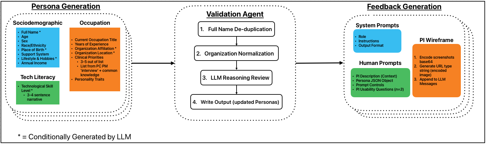

# Synthetic Feedback Generation Pipeline



> This pipeline leverages LLMs and persona-based prompting to generate diverse feedback datasets, based on wireframes and short text narratives of applications/software. The current implementation of this pipeline is tightly coupled with Clinician personas and a prototype Patient Intake application, but can be modified to fit any software feedback scenario.

## Installation

OS X & Linux:
1. Clone or download the repository.
2. Set up miniconda environment:
    - If miniconda is not installed on the local machine, please follow the steps outlined here before continuing: [Miniconda installation](https://docs.anaconda.com/free/miniconda/)
    - Once miniconda is installed, locate agentic_conda_env.yml at the root of this project and adjust the desired name of the conda environment (first line in that yml file.)
    - Create the conda environment by copying this command into a shell (terminal) with an active base conda environment:
        ```sh
        conda env create -f agentic_conda_env.yml
        ```
    - Then activate the new conda environment:
        ```sh
        conda activate <conda_env name>
        ```

## Usage example
1. Open a terminal and navigate to /src/:
```sh
cd src
```
2. Use the following command to run the project: 
```sh
python3 main.py
```
> The current implementation leverages OpenAI's GPT models to create 2 clinician personas, validate them, and generate feedback. An OpenAI API key is required to run the pipeline as-is, but can be easily modified to leverage other LLMs.
Options:
- `-h, --help`: Show help menu


<br>
Example:

1. After navigating to src (cd src), run the following command:
```sh
python3 main.py ...
```

## Description of Data

### Description of output

---

## Requirements
- Python 3.13 or higher. 
    - This project was developed in python v3.11 and has been tested with python 3.9 thru 3.12.
- Miniconda (see Installation section for further instructions).
- macOS or Linux based operating system.

## Contributing

1. Fork it (<https://github.com/alexKotz-koz/...>)
2. Create your feature branch (`git checkout -b feature/fooBar`)
3. Commit your changes (`git commit -am 'Add some fooBar'`)
4. Push to the branch (`git push origin feature/fooBar`)
5. Create a new Pull Request
